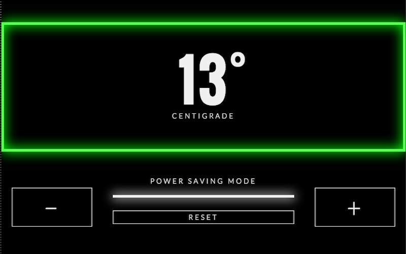
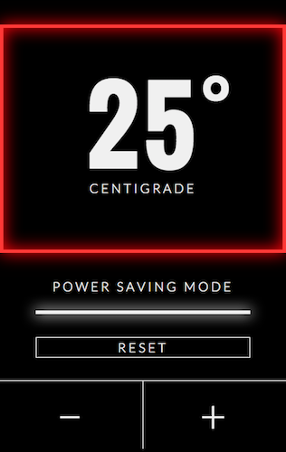
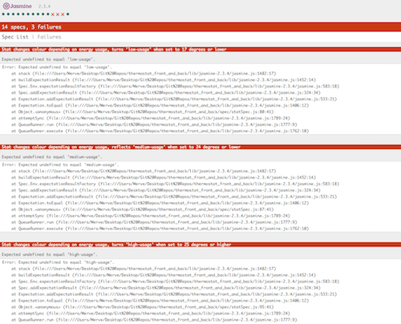

# Thermostat_front_and_back

## *The most Thermostatic app you've ever seen, built from back to front!*

## __TL;DR:__

This Thermostat App was built from scratch and shows I have a good understanding of Back End code, and how specifically [JavaScript](https://developer.mozilla.org/en-US/docs/Web/JavaScript) can be used for more than just Front End projects.

Thermostatic's back is built in pure [JavaScript](https://developer.mozilla.org/en-US/docs/Web/JavaScript), and is [Unit Tested](https://developer.mozilla.org/en-US/Add-ons/SDK/Tutorials/Unit_testing) using the [Jasmine](http://jasmine.github.io/) test suite. Added to this the App includes [jQuery](https://jquery.com/) for the interface and a [Meyer-reset](http://meyerweb.com/eric/tools/css/reset/) for the CSS.

The Specifications were as follows:

* Thermostat must start at 20 degrees
* You can increase the temperature with the up button
* You can decrease the temperature with the down button
* The minimum temperature is 10 degrees
* The maximum temperature is 32 degrees
* Power saving mode is on by default
* If power saving mode is on, the maximum temperature is 25 degrees
* If power saving mode is off, the maximum temperature is 32 degrees
* You can reset the temperature to 20 by hitting the reset button
* The thermostat should color the display based on energy usage - < 18 is green, < 25 is yellow, otherwise red

Desktop View                                                               |  Mobile View
:-------------------------------------------------------------------------:|:----------------------------------------------------------------------:
 |  

## So hot its cool

Despite the bad pun, it was very fun to build something entirely from scratch and use JavaScript in a format that I'm not as used to. I have used Jasmine as a testing suite for my apps in the past but became much more familiar with it thanks to this project.

As an extra level of difficulty, I asked for a design spec from a friend rather than build something random from my own imagination. Building to web designers specifications is a crucial part of being a Front End developer and I wanted to see what challenges it could possibly raise in a working environment.

## Tools

* CSS
* HTML
* JavaScript
* jQuery
* Jasmine
* Meyer-Reset

## Mistakes made and lessons learnt

Re-familiarising myself with JavaScript as a Back End language was challenging if only for the syntax, but overall it was a pleasent experience and I gained much from doing so.

Using the Jasmine testing suite meant bugs were much easier to catch and fix then they would have been otherwise, and my code became a lot cleaner as a result. But it did mean that every time I altered the code slightly, or even logically, Jasmine would display what seemed like a world ending break error message about my code!. So it would on first appearance, seem to have gone from 1 bug, to 100!

Luckily once  one is familiar with these Jasmine errors, the syntax and the way it 'works', these messages are less intimidating, and more useful.

Originally I used absolute positioning to create the designs but found that I had used it incorrectly much to my displeasure, and had to start again, twice over...it did mean I got to learn about z-index in more detail though. In the end I did use absolute positioning after all, but not in the way I had originally expected.

__vh__ and __vw__ were new measurement tools I had not applied before and they solved a lot of the sizing issues I had when it came to making the layouts responsive.

Getting the jQuery to change the colour display dependent on the temperature setting presented a challenge I could not over come, but after having my code reviewed it turned out to be 'code blindness' rather than any drastic errors on my part. This was both a relief and incredibly frustrating as always.

## Conclusion

&#127932; 99 JavaScript Bugs in my code!... &#9836; &#9834;

&#127932; 99 JavaScript Bugs!... &#9834;

&#127932; &#119083; You take one down! &#9833;

&#127932; &#119083; You patch it around! &#9833;

&#127932; 1570342 JavaScript Bugs in my code!... &#9836; &#9834;

